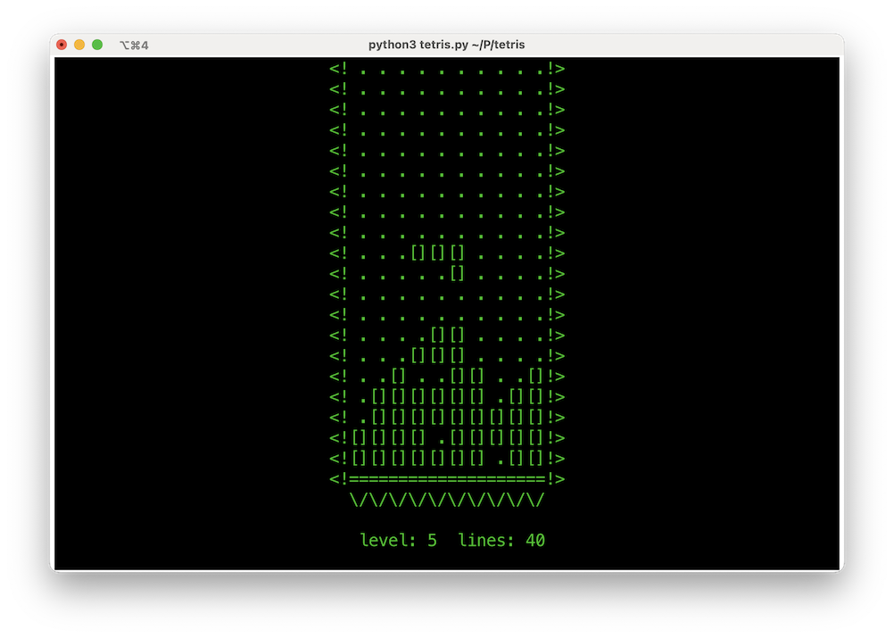

## "[Tettaracontris](https://en.wikipedia.org/wiki/Numeral_prefix)" – a Tetris in 40

A minimalistic implementation of [Tetris](https://tetris.com) inspired by the original [Electronika 60](https://en.wikipedia.org/wiki/Electronika_60) version (or at least [what it looks like in the movie](https://youtu.be/-BLM1naCfME) :)). It is written in Python (3.7+) with no external dependencies, so you can simply download – or copy & paste – and then run:
```bash
$ python3 tetris.py
```


